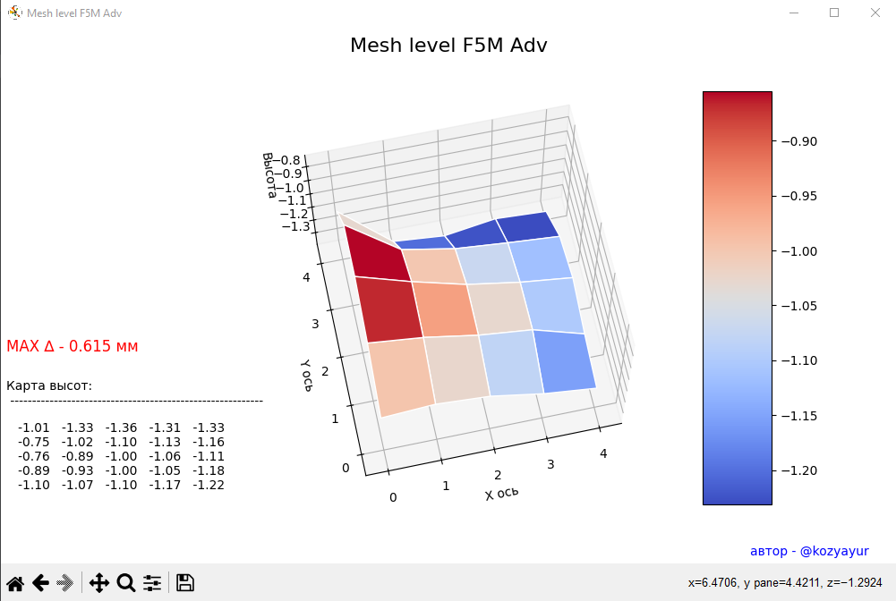

# Flashforge-bed-level
Flashforge 5M advanture bed leveling visualisation

F5m does not have an ideal bed level from the factory.
This program can help you to adjust bed level by adjusting screw in the corners  
I used Python 3.9

